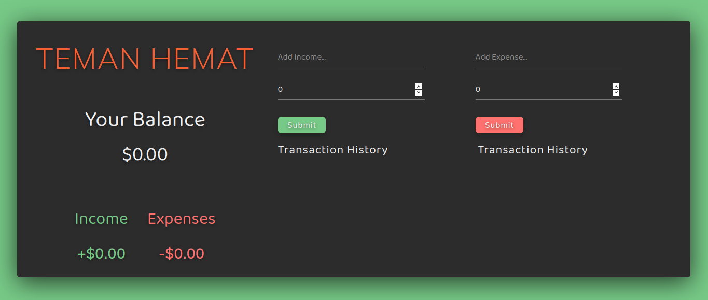
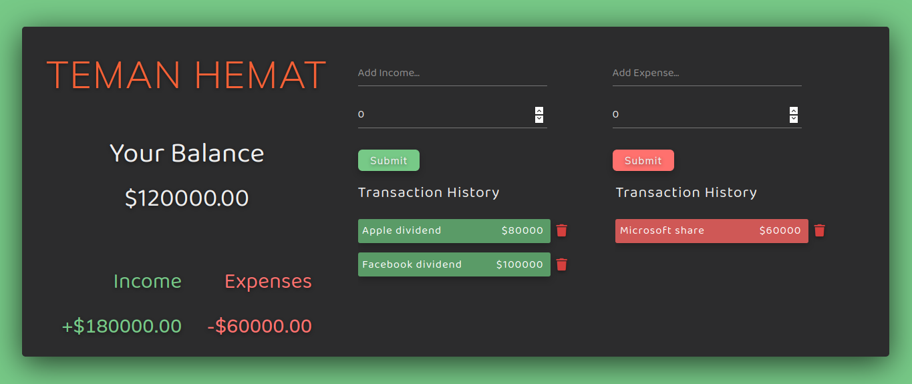

# Expense Tracker

<h4>💵 An expense tracker that helps you managing your financial, powered by React</h4>

It also persists your incomes and expenses as it saves your input to your browser's local storage, so feel free to refresh the tab :)

<br>

## Demo

This is how Expense Tracker looks:

</img>

<br>

Expense Tracker also presents your incomes and expenses in detail:

</img>

<br>

## How to Run

In the project directory, you can :

1) Install dependencies :
```
yarn
```

2) Run this app on your browser :
```
yarn start
```

Runs the app in the development mode.<br />
Open [http://localhost:3000](http://localhost:3000) to view it in a browser.

<br>

[](https://github.com/kevinadhiguna)
